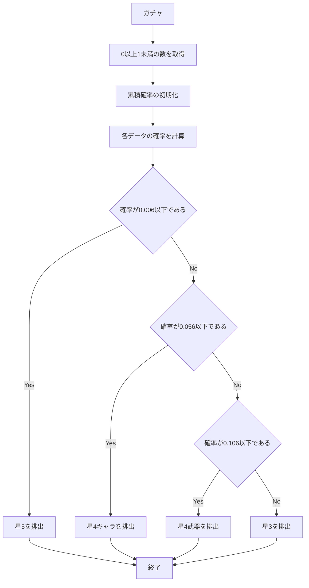
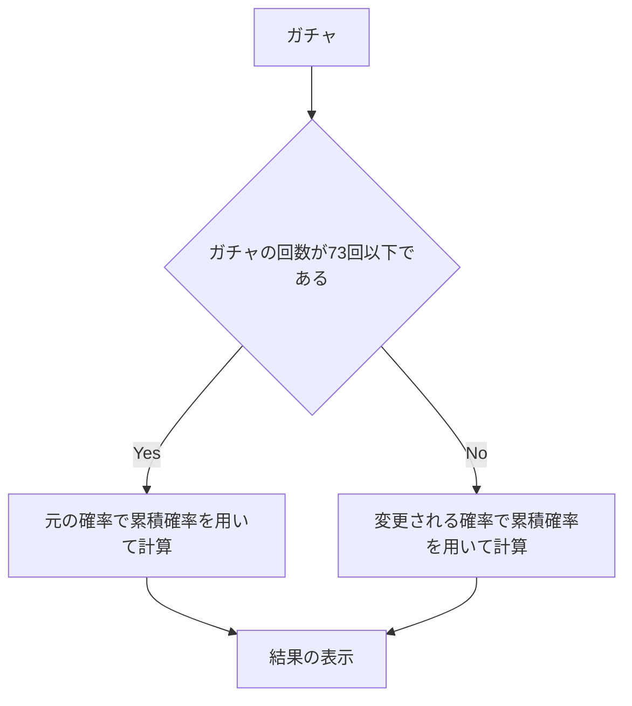

# app5.jsの仕様書
## app5.jsに実装されている機能
app5.jsには以下の機能を実装した.
1. hello1
1. hello2
1. icon
1. luck
1. janken
1. gatya
1. find_number
## それぞれの機能の説明(ユーザーができること)
1. hello1
* この機能はプログラム上で指定した文字をweb上に表示できるというものだ.
* ただweb上では表示する文字を変更することはできなためでユーザーが行うことがきるのは文字の閲覧のみとなる.
2. hello2
* この機能はhello1と同様の内容を別のプログラムを用いて表したものである.
* そのため,hello2でできることはhello1と同様である.
3. icon
* この機能はプログラム上で指定した画像をweb上に表示できるというものだ.
* hello1と同様にweb乗で表示する画像の変更ができないためでユーザーが行うことがきるのは画像の閲覧のみとなる.
4. luck
* この機能はユーザーの運勢を大吉,中吉,小吉,末吉,凶,大凶の6つの中から占うものである.
* 一度表示した結果を変更するにはページを更新すると再度ランダムな運勢が表示される.
5. janken
* この機能はweb上でジャンケンができるというものである.
* web画面上には自分の出した手,コンピュータが出した手,勝敗,総試合数,勝利数,手の入力欄,送信ボタンが表示されている.
* やり方は入力欄にグー,チョキ,パーと入力し送信することで結果が返ってくるというものだ.勝敗の決め方をグー,チョキ,パーを用いてせっていしているためひらがなの「ぐー,ちょき,ぱー」や「グー,チョキ,パー」以外の文字を入力すると負けの判定になる.
6. gatya
* この機能はオープンワールド・アクションロールプレイングゲームの原神のガチャの機能を再現したものである.
* web画面上にはガチャの結果,ガチャの回数,デバック用の判定,今まで獲得したものの総数,星5の確率,ガチャボタンが表示されている.
* 使い方としてはガチャボタンを押すと一回ガチャをすることができる.
7. find_number
* この機能はランダムに選ばれた1〜100までの数字を当てるというゲームである.
* web画面上にはゲームの説明,数字の入力欄,送信ボタン,入力した数字に対する評価,試行回数が表示されている.
* 使い方としては書いてある説明の通りに数字を入力し,送信ボタンで隠された数字を当てる.送信した数字が隠された数字と比べて大きい場合はもっと小さい！,小さい場合はもっと大きい！,一致した場合は正解！と表示される.
## それぞれの機能の利用方法
1. hello1
* ターミナル上でapp5.jsのあるディレクトリに移動し,[npm start]と入力し実行することでサーバを起動する.
* ブラウザ上で[URL](http://localhost:8080/hello1)にアクセスする.
2. hello2
* ターミナル上でapp5.jsのあるディレクトリに移動し,[npm start]と入力し実行することでサーバを起動する.
* ブラウザ上で[URL](http://localhost:8080/hello2)にアクセスする.
3. icon
* ターミナル上でapp5.jsのあるディレクトリに移動し,[npm start]と入力し実行することでサーバを起動する.
* ブラウザ上で[URL](http://localhost:8080/icon)にアクセスする.
4. luck
* ターミナル上でapp5.jsのあるディレクトリに移動し,[npm start]と入力し実行することでサーバを起動する.
* ブラウザ上で[URL](http://localhost:8080/luck)にアクセスする.
5. janken
* ターミナル上でapp5.jsのあるディレクトリに移動し,[npm start]と入力し実行することでサーバを起動する.
* ブラウザ上で[URL](http://localhost:8080/janken)にアクセスする.
6. gatya
* ターミナル上でapp5.jsのあるディレクトリに移動し,[npm start]と入力し実行することでサーバを起動する.
* ブラウザ上で[URL](http://localhost:8080/gatya)にアクセスする.
7. find_number
* ターミナル上でapp5.jsのあるディレクトリに移動し,[npm start]と入力し実行することでサーバを起動する.
* ブラウザ上で[URL](http://localhost:8080/find_number)にアクセスする.
## プログラム上の仕様
1. hello1
* このプログラムはconst messageでメッセージを定義しそれを表示している.
* そのためconst messageで定義する内容を変更すると表示する文字を変えることができる.
2. hello2
* このプログラムはhello1と表示される内容は一致しているが,プログラムが異なっている.
* これはテンプレート上で文字の定義を行っているため,その定義の内容を変更することで表示する文字の変更ができる.
3. icon
* このプログラムは何かしらの画像データとその画像を表示できなかった時の代替テキストを用いて画像の表示をしている.
* そのためfilenameおよびaltに入れるものを変更することで表示する画像を変更できる.
4. luck
*  このプログラムはnumに1~6までのランダムな数をランダム関数を用いて代入し,その値に対応したluckが選択されそれが結果としてweb上に表示される.
5. janken
*  このプログラムはランダム関数でコンピュータ側が出す手を選択しており,特定の組み合わせになった時に勝ち,それ以外は負けと表示するようにすることでジャンケンが成り立つようになっている.
6. gatya
* このプログラムはあらかじめ星５,星４(武器),星４(キャラ),星３に出現する確率を設定し,ガチャの回数がある値(ここでは73回)を超えると確率が変動するものになっている.
*  また,このガチャの排出するものを選ぶのに累積確率を用いている.これはランダムに選ばれた0以上1未満の数をそれぞれの確率(星５,星４(武器),星４(キャラ),星３に出現する確率)を累積してその値を超えた時のものを結果として表示するというものだ.
7. find_number
* このプログラムはランダム関数で1~100までの数を設定し,ユーザーが入力した値とランダム関数で出た値を比較して適切なメッセージを表示するというものだ.
## 累積確率の流れ

## gatyaのフローチャート

    

